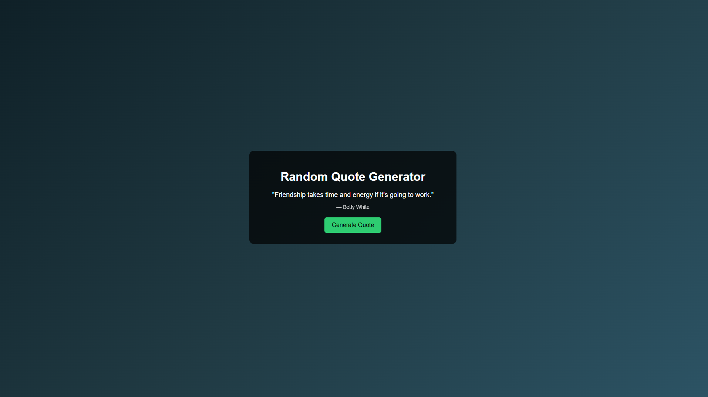
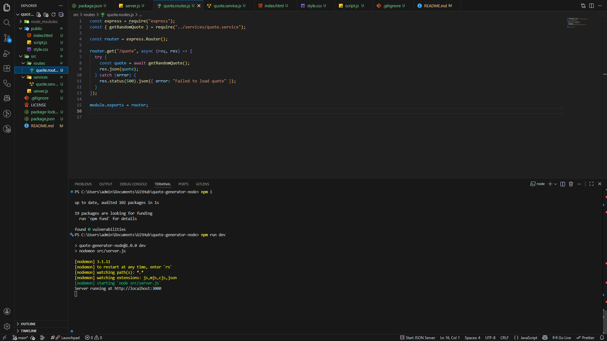

📜 Random Quote Generator com Node.js

Este projeto foi desenvolvido como parte de um desafio prático da Escola Nova Era, com o objetivo de criar uma aplicação simples em Node.js que consome uma API pública para gerar citações aleatórias e exibi-las em uma interface web.

🎯 Objetivo do Projeto

Permitir que o usuário:

Acesse uma página web simples

Visualize uma citação aleatória

Gere uma nova citação ao clicar em um botão

Consuma uma API pública utilizando boas práticas de backend

🧩 Funcionalidades

✔ Servidor backend com Express.js
✔ Consumo da API pública Quotable
✔ Rota dedicada para fornecimento das citações
✔ Frontend simples com HTML, CSS e JavaScript
✔ Tratamento de erros para falhas na API
✔ Estrutura organizada (routes, services, public)

🖼️ Screenshots do Projeto
📌 Interface do usuário

Imagem da aplicação rodando no navegador, exibindo a citação e o botão para gerar uma nova frase:

📌 Execução do servidor

Servidor Node.js rodando localmente com sucesso na porta 3000:

🗂 Estrutura do Projeto
quote-generator-node/
│
├── public/
│   ├── img/
│   │   ├── ui-project.png
│   │   └── terminal-project.png
│   ├── index.html
│   ├── script.js
│   └── style.css
│
├── src/
│   ├── routes/
│   │   └── quote.routes.js
│   ├── services/
│   │   └── quote.service.js
│   └── server.js
│
├── .gitignore
├── package.json
├── package-lock.json
└── README.md

🔌 API Utilizada

Quotable API

Endpoint:

https://api.quotable.io/random

Essa API retorna uma citação aleatória junto com o nome do autor.

🚀 Como Executar o Projeto Localmente
1️⃣ Clonar o repositório
git clone https://github.com/seu-usuario/quote-generator-node.git

2️⃣ Acessar a pasta do projeto
cd quote-generator-node

3️⃣ Instalar as dependências
npm install

4️⃣ Rodar o servidor
npm run dev

5️⃣ Acessar no navegador
http://localhost:3000

⚠️ Tratamento de Erros

Caso a API externa esteja indisponível ou ocorra algum erro de requisição, a aplicação exibe uma mensagem amigável ao usuário informando que a citação não pôde ser carregada.

🏫 Sobre o Desafio

Este projeto faz parte dos desafios práticos da Escola Nova Era, com foco em:

Fundamentos de Node.js

Consumo de APIs externas

Organização de código backend

Integração simples entre frontend e backend

Boas práticas de desenvolvimento

👨‍💻 Autor

Vitor Dutra Melo

📍 Londres – Reino Unido

💻 Estudante de Desenvolvimento de Software

📫 Contato: vitordutra1125@gmail.com

